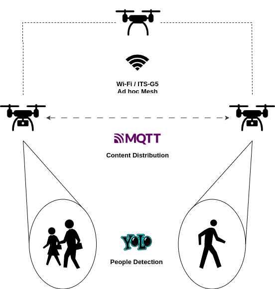

# rsa-project

## Setup

1. Create a python virtual environment and activate it

```bash
python3 -m venv venv
source venv/bin/activate
```

2. Install the requirements

```bash
pip3 install -r requirements.txt
```

3. Run the app

```bash
python3 src/app.py [-i <image>]
```

## Architecture Diagram

